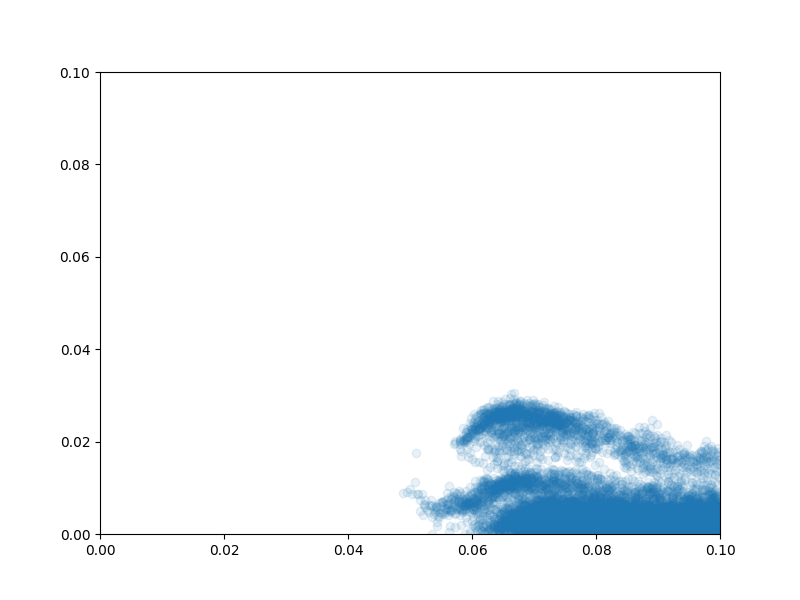
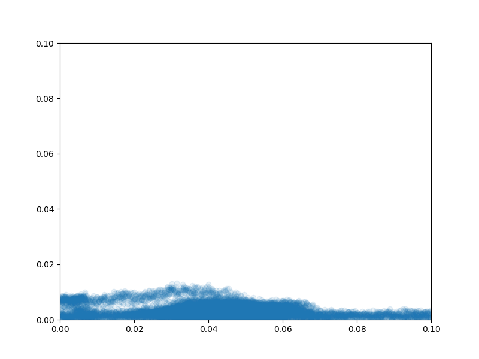

# Particle-Based-Fluid-Simulation

## Usage

You could compile code with `sh compile.sh 2` for generating 2-Dimension solver or `sh compile.sh 3` for 3-Dimension solver.

After modifying parameters in `tools/input.json`, execute following commands:

```
./build/main tools/input.json
python3 build/SPH_painter.py tools/input.json
```

Results would be like:

<video id="video" controls="" preload="none" poster=".assets/Figure_2.png">
      <source id="mp4" src=".assets/10000_1000.mp4" type="video/mp4">
</videos>

<!-- 
 -->

## TODO
- Dimension in config.
- Adding Animation for 3D.
